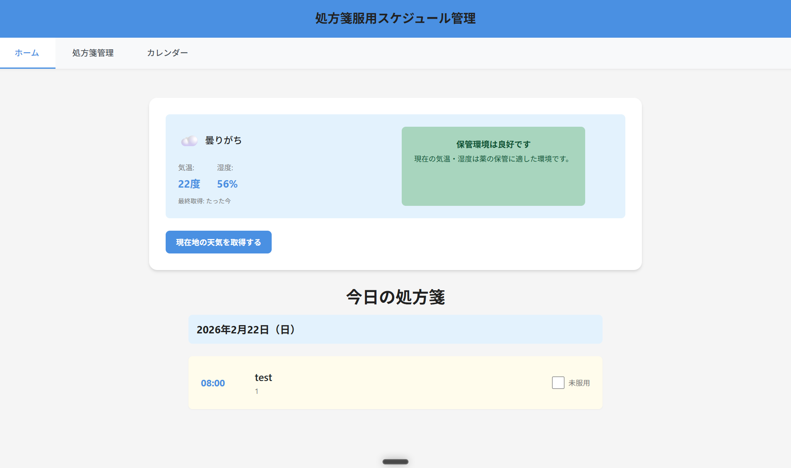
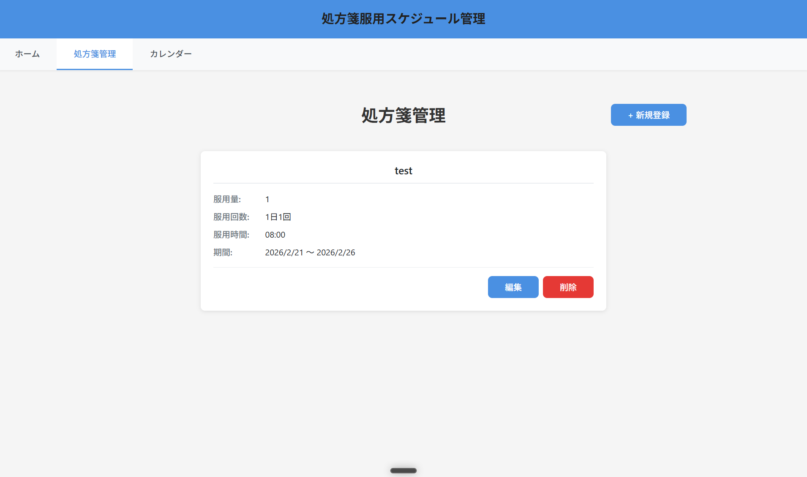
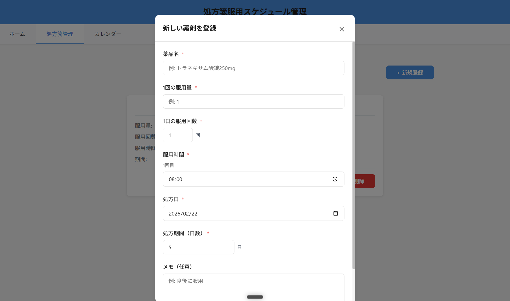
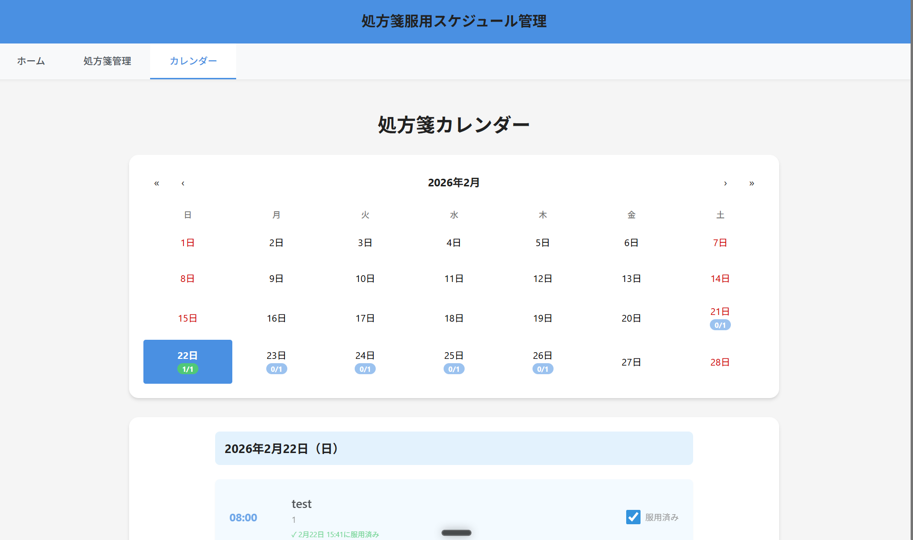

# 処方箋服用スケジュール管理アプリ

処方された薬の服用スケジュールを管理し、飲み忘れを防ぐための Web アプリケーションです。  
体調を崩した時、5日分の処方箋を処方されたのに5日後には1回分余っていて、いつ飲み忘れたのか朧げになった実体験から開発しました。  
天気情報と連携し、気温・湿度に基づいた薬の保管環境アラートも提供します。

---

## デモ

🔗 **ライブデモ**: https://portfolio-app-two-gamma.vercel.app/

---

## デモ

🔗 **ライブデモ**: https://portfolio-app-two-gamma.vercel.app/

---

## 主な機能

| 機能             | 説明                                                             |
| ---------------- | ---------------------------------------------------------------- |
| 薬剤管理         | 薬品名・服用量・服用回数・服用時刻・服用期間の登録・編集・削除   |
| 服用スケジュール | 指定日の服用予定一覧を表示し、服用済みチェックを記録             |
| カレンダー表示   | 月カレンダーで服用状況（完了数／総数）を日付ごとに確認           |
| 天気連携         | 現在地の気温・湿度を取得し、薬の保管環境を警告またはバナー表示   |
| オフライン動作   | IndexedDB にデータを永続化するため、インターネット接続不要で動作 |

---

## 技術スタック

| カテゴリ | ライブラリ・バージョン | 選定理由 |
|---|---|---|
| UI フレームワーク | React 18.2.0 | コンポーネント単位での UI 管理が複数画面の構成に適しており、エコシステムが充実しているため採用 |
| 言語 | TypeScript 5.4.0 | 薬剤データ・天気データなど構造が明確な型を定義し、null 参照や誤ったプロパティアクセスによるバグを開発時点で検出するために採用 |
| ビルドツール | Vite 4.0.0 |起動・HMR が高速であるため採用 |
| ルーティング | React Router DOM 7.13.0 | SPA 構成でホーム・薬剤管理・カレンダーの 3 画面を独立したルートとして管理するために採用 |
| 状態管理 | Zustand 5.0.11 | Redux も検討したが、このアプリの規模にはボイラープレートが多すぎるため、シンプルな API で扱えるZustand を採用 |
| ローカル DB | Dexie (IndexedDB ラッパー) 4.3.0 | 生の IndexedDB API も検討したが、非同期処理の記述が複雑になりすぎるため、直感的な API を持つ Dexie を採用。オフライン動作の実現にも寄与 |
| 日時操作 | Day.js 1.11.19 | Moment.js も検討したが、バンドルサイズが大きく開発が終了しているため、軽量で同等の操作性を持つ Day.js を採用 |
| カレンダー UI | React Calendar 6.0.0 | 各日付へのカスタムコンテンツ（服用状況バッジ）を差し込める柔軟性を持ち、自前実装のコストを避けるために採用 |
| フォーム管理 | React Hook Form 7.71.1 | 非制御コンポーネントベースで再レンダリングが最小限に抑えられ、バリデーション定義も宣言的に書けるため採用 |
| 天気 API | OpenWeatherMap API (v2.5) | 当初は openFDA API で薬品詳細情報を取得する機能を検討したが、日本語非対応のため断念。代替として無料枠で気温・湿度を取得できる OpenWeatherMap API を採用し、薬の保管環境アラート機能に転換 |
| Linter | ESLint 9 + typescript-eslint + eslint-plugin-react | TypeScript に対応したルールセットで `any` 型の使用などコード品質に関わる問題を自動検出するために採用 |
---

## ディレクトリ構成
```
/
├── index.html
├── vite.config.ts
├── tsconfig.json
├── tsconfig.node.json
├── package.json
├── .env                              # 環境変数（要作成）
├── api/
│   └── weather.ts                    # Vercel Serverless Functions（天気API プロキシ）
├── public/
└── src/
    ├── main.tsx
    ├── App.tsx
    ├── App.css
    ├── index.css
    ├── vite-env.d.ts                 # Vite 環境変数の型定義
    ├── types/
    │   └── index.ts                  # 全型定義
    ├── styles/
    │   └── global.css                # グローバルスタイル
    ├── db/
    │   ├── database.ts               # Dexie DB 定義 + CRUD 操作関数
    │   └── database.test.ts
    ├── api/
    │   ├── weatherAPI.ts             # OpenWeatherMap API 呼び出し + 位置情報取得
    │   └── index.ts                  # API モジュールの再エクスポート
    ├── store/
    │   ├── medicationStore.ts        # 薬剤データの Zustand ストア
    │   └── weatherStore.ts           # 天気データ・設定の Zustand ストア
    ├── utils/
    │   ├── scheduleUtils.ts          # スケジュール生成・マージユーティリティ
    │   ├── scheduleUtils.test.ts
    │   ├── weatherUtils.ts           # 天気警告判定・アイコン取得ユーティリティ
    │   └── weatherUtils.test.ts
    ├── test/
    │   └── setup.ts                  # テストセットアップ（vitest）
    ├── pages/
    │   ├── Home/
    │   │   ├── Home.tsx              # ホーム画面（今日の服用予定 + 天気情報）
    │   │   └── Home.css
    │   ├── Medications/
    │   │   ├── Medications.tsx       # 薬剤管理画面（一覧・登録・編集・削除）
    │   │   └── Medications.css
    │   ├── Calendar/
    │   │   ├── Calendar.tsx          # カレンダー画面（月表示 + 日別詳細）
    │   │   └── Calendar.css
    │   └── NotFound/
    │       ├── NotFound.tsx          # 404 ページ
    │       └── NotFound.css
    └── components/
        ├── Layout/
        │   ├── Layout.tsx            # 共通レイアウト（ヘッダー + ナビゲーション）
        │   └── Layout.css
        ├── Header/
        │   ├── Header.tsx            # ヘッダーコンポーネント
        │   └── Header.css
        ├── Navigation/
        │   ├── Navigation.tsx        # ナビゲーションコンポーネント
        │   └── Navigation.css
        ├── ErrorBoundary/
        │   ├── ErrorBoundary.tsx     # エラーバウンダリーコンポーネント
        │   └── ErrorBoundary.css
        ├── MedicationCard/
        │   ├── MedicationCard.tsx    # 薬剤情報カードコンポーネント
        │   └── MedicationCard.css
        ├── MedicationForm/
        │   ├── MedicationForm.tsx    # 薬剤登録・編集フォームコンポーネント
        │   └── MedicationForm.css
        ├── MedicationList/
        │   ├── MedicationList.tsx    # 薬剤一覧コンポーネント
        │   └── MedicationList.css
        ├── Modal/
        │   ├── Modal.tsx             # 汎用モーダルコンポーネント
        │   └── Modal.css
        ├── ScheduleList/
        │   ├── ScheduleList.tsx      # 服用予定リストコンポーネント
        │   └── ScheduleList.css
        └── WeatherAlert/
            ├── WeatherAlert.tsx      # 天気警告 / 良好バナーコンポーネント
            └── WeatherAlert.css
```
■ ストアの責務

 - medicationStore: 薬剤データの CRUD 操作と一覧管理
 - weatherStore:    天気データの取得・キャッシュ・設定管理


■ データフロー

ユーザー操作 → Component → Zustand Store → Dexie (IndexedDB)
                                          → OpenWeatherMap API

 - Component はストア経由でのみデータにアクセスし、DB を直接操作しない
 - Zustand Store が状態管理とDB操作の仲介を担い、UIとデータ層を分離
 - 天気データは API → Store → IndexedDB の順で保存し、キャッシュとして再利用

■ ストアの責務

- medicationStore: 薬剤データの CRUD 操作と一覧管理
- weatherStore: 天気データの取得・キャッシュ・設定管理

■ データフロー

ユーザー操作 → Component → Zustand Store → Dexie (IndexedDB)
→ OpenWeatherMap API

- Component はストア経由でのみデータにアクセスし、DB を直接操作しない
- Zustand Store が状態管理とDB操作の仲介を担い、UIとデータ層を分離
- 天気データは API → Store → IndexedDB の順で保存し、キャッシュとして再利用

---

## セットアップ

### 1. リポジトリをクローン

```bash
git clone <リポジトリURL>
cd <プロジェクトディレクトリ>
```

### 2. 依存パッケージをインストール

```bash
npm install
```

### 3. 環境変数ファイルを作成

プロジェクトルートに `.env` ファイルを作成してください（[環境変数](#環境変数) を参照）。

### 4. 開発サーバーを起動

```bash
npm run dev
```

ブラウザで `http://localhost:5173` を開いてください。

### 5. 本番ビルド

```bash
npm run build
```

ビルド成果物は `dist/` ディレクトリに出力されます。

---

## 環境変数

プロジェクトルートに `.env` ファイルを作成し、以下の変数を設定してください。

```env
VITE_OPENWEATHER_API_KEY=(あなたのAPIキー)
```

| 変数名                     | 説明                                          | 必須                               |
| -------------------------- | --------------------------------------------- | ---------------------------------- |
| `VITE_OPENWEATHER_API_KEY` | OpenWeatherMap API キー（無料プランで取得可） | 天気連携機能を使用する場合のみ必須 |

> API キーは [OpenWeatherMap](https://openweathermap.org/api) で無料登録後に取得できます。  
> キーを設定しない場合、天気連携機能は動作しませんが、薬剤管理・スケジュール機能は使用できます。

---

## 画面構成

### ホーム画面 (`/`)

- 今日の服用予定リストを表示
- 各予定に「服用済み」チェックボタンを表示
- 天気連携の ON/OFF トグルと手動更新ボタン
- 天気連携が有効な場合、現在地の気温・湿度・天気概要を表示
- 保管環境に問題がある場合は警告バナー、良好な場合は良好バナーを表示

ホーム画面


ホーム画面


### 薬剤管理画面 (`/medications`)

- 登録済み薬剤の一覧カード表示
- 新規薬剤の登録フォーム（薬品名・服用量・服用回数・服用時刻・期間・メモ）
- 既存薬剤の編集・削除
- 服用期間が終了した薬剤には「服用終了」バッジを表示

管理画面

新規登録画面


### カレンダー画面 (`/calendar`)

- 月カレンダーで各日付の服用状況を確認
  - `完了数/総数` バッジを各日付に表示
  - 全完了：緑バッジ、一部完了：黄バッジ、未完了：青バッジ
- 日付クリックでその日の服用予定詳細を下部に表示

カレンダー画面


---

## 天気連携機能

### 動作フロー

1. ホーム画面で天気連携トグルを ON にする
2. ブラウザが位置情報の許可を要求する
3. 許可後、OpenWeatherMap API から現在地の天気データを取得
4. 取得データを IndexedDB に保存し、画面に表示
5. 以降は 6 時間ごとに自動更新（手動更新ボタンでも即時取得可能）

### 警告基準

天気ユーティリティ（`weatherUtils.ts`）に定数として定義されています。気温・湿度が基準値を超えた場合に警告バナーを表示します。

### データ保持期間

天気データは最新から 7 日分のみ IndexedDB に保持されます。古いデータは自動削除されます。

---

## 注意事項

- **オフライン動作:** データは IndexedDB に保存されるため、インターネット接続がなくても薬剤管理・スケジュール確認が可能です。天気連携機能のみインターネット接続が必要です。
- **位置情報:** 天気連携には、ブラウザの位置情報権限が必要です。権限を拒否した場合、天気連携機能は使用できません。
- **データのバックアップ:** データはブラウザの IndexedDB に保存されます。ブラウザのデータ消去（キャッシュ・Cookie 削除など）を行うと、登録データが失われる場合があります。

---
## 工夫した点
- 天気情報の表示形式
  - ポートフォリオを確認する採用担当者が位置情報の許可操作なしで天気連携機能を体験できるよう、デフォルトで東京の天気データを取得・表示する設計にした。
  - 位置情報からの取得はオプションとして別途ボタンで提供し、ユーザーに操作の選択肢を与えた。
  - また、APIの呼び出し頻度を1日1回に制限し、キャッシュを活用して不要な通信を抑制した。
- ユニットテスト
  - 品質を担保するため vitest を導入し、ユーティリティ関数を中心にユニットテストを整備した
- エラーへの対応
  - 予期しないエラーでアプリ全体がクラッシュすることを防ぐため、ErrorBoundary と NotFoundページを導入しユーザーフレンドリーな復帰導線を用意した
- ID生成形式の変更
  - 当初はID生成に Math.random() を使用していたが、衝突リスクと非推奨メソッドの使用を解消するため crypto.randomUUID() に移行した

